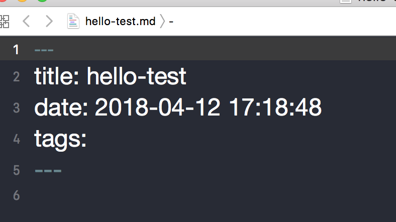

# 前言


我在2015年的时候，就尝试写博客，当时是在CSDN注册的账号，更新了几篇之后，由于懒，就没再更新了。现在连账号都找不到了，囧。最近突发奇想，觉得搞一个博客，积累一下平时学习的知识，也蛮好的。于是就有了这篇博客，分享一下我的搭建个人博客的经历。


# 方案选择
网上有各种各样的搭建个人博客的方式，最初我是选则GitHub Pages + Jekyll的方案，后来搜了一下Jekyll的主题，感觉不是很美丽（如想使用Jekyll可以参考[一步步在GitHub上创建博客主页](http://www.pchou.info/ssgithubPage/2013-01-03-build-github-blog-page-01.html) 。最终选择了Hexo + GitHub Pages的方案，而且不需要购买域名，可以说是零成本。
# 关于GitHub Pages

[GitHub Pages](https://pages.github.com) 是GitHub推出的一个服务，非常适合搭建博客。主要考虑以下几个优点：

- 提供300M免费存储空间（相当于一个免费的服务器，而且是没有流量限制）
- 提供域名usernmae.github.io（免费的域名，不足之处就是可能国内访问速度不怎么快）
- 有Hexo和Jekyll等博客框架的支持（有很多热心的开发者贡献了较多的主题，可以随意挑选）

>If you create a repository named you.github.com, where you is your username, and push content to it, we’ll automatically publish that to http://you.github.com. No FTP, no scp, no rsync, nothing. Just a simple git push and you’re done. You can put anything here you like. Use it as a customizable home for your Git repos. Create a blog and spread your ideas. Whatever you want!

GitHub Pages也非常乐意，大家在上面搭建博客。

首先，你要有一个GitHub的账户，建立一个`yourusername.github.io`的仓库，这个操作对经常使用GitHub的人来说不算难事，这里不详细介绍了，如果不会的话可以百度或者参考[这里](http://www.pchou.info/ssgithubPage/2013-01-03-build-github-blog-page-01.html)。创建完成后，就可以进行下一步了。

# Hexo搭建

Hexo环境搭建，会依赖较多的工具。安装的过程也会出现各种各样的错误，根据错误在网上搜一下，见招拆招，基本能顺利解决问题。
### 安装RVM和Ruby

RVM 是一个命令行工具，可以提供一个便捷的多版本 Ruby 环境的管理和切换

```highlight shell
$ \curl -sSL https://get.rvm.io | bash -s stable
$ source ~/.bashrc
$ source ~/.bash_profile

```

列出已知的 Ruby 版本

```highlight shell
rvm list known
```

安装一个 Ruby 版本

```highlight shell
rvm install 2.2.0 --disable-binary
```

这里安装了最新的 2.2.0, rvm list known 列表里面的都可以拿来安装。

切换 Ruby 版本

```highlight shell
rvm use 2.2.0
```

如果想设置为默认版本，这样一来以后新打开的控制台默认的 Ruby 就是这个版本

```highlight shell
rvm use 2.2.0 --default 
```

查询已经安装的ruby

```highlight shell
rvm list
```

卸载一个已安装版本

```highlight shell
rvm remove 1.8.7
```

RVM的安装主要是为了控制Ruby的版本，我此次使用的Ruby版本是最新的2.4.1，如果安装遇到困难的可以查看[这里](https://ruby-china.org/wiki/rvm-guide)。

### 安装Node和npm

在安装Ruby过程中，系统会自动安装Homebrew，因此直接可以用Homebrew来安装Node。

```highlight shell
brew install node
```
执行以下命令查看是否安装成功

```highlight shell
node -v
npm -v
```
### 安装Hexo

[Hexo](https://hexo.io)的安装很简单，官方网站给出的安装方式：

```highlight shell
npm install hexo-cli -g
hexo init blog
cd blog
npm install
hexo server
```
    
这样Hexo的环境已经搭建完成，并且blog这个文件夹就是一个简单的demo。执行过`hexo server`后就能用浏览器通过`http://localhost:4000/`来访问自己的博客页了。


# 撰写博文

### 新建博文
完成以上步骤之后，可以预览到自己的博客效果了，接下来我比较关心的是如何新建文章。新建文章有个要注意的地方是，不能直接把普通.md拖进`_post`目录下，是会报错的。

```highlight shell
 hexo new hello-test    # 格式是： hexo new ｛文章名｝
```

需要通过命令来创建新的文章,打开新建的`hello-test.md`



在blog的根目录下，`_config.yml`文件比较重要，主要是对Hexo的配置以及站点的相关配置。


### 博文图片

关于博文图片，网上很多例子都是推荐七牛云，通过贴链接的方式，把图片加在博文中。我这里推荐将图片放在本地。

1 把主页配置文件`_config.yml` 里的`post_asset_folder:`这个选项设置为`true`

2 在你的hexo目录下执行这样一句话`npm install hexo-asset-image --save`，这是下载安装一个可以上传本地图片的插件，来自dalao：dalao的git

3 等待一小段时间后，再运行`hexo n "xxxx"来生成md博文时，/source/_posts`文件夹内除了`xxxx.md`文件还有一个同名的文件夹

4 最后在`xxxx.md`中想引入图片时，先把图片复制到xxxx这个文件夹中，然后只需要在`xxxx.md`中按照markdown的格式引入图片：

``

注意： xxxx是这个md文件的名字，也是同名文件夹的名字。只需要有文件夹名字即可，不需要有什么绝对路径。你想引入的图片就只需要放入xxxx这个文件夹内就好了，很像引用相对路径。

最后自己验证一下能否正确加载即可。

# 更换主题

Hexo的主题相当于是博客的模板，在Hexo官网的[Themes](https://hexo.io/themes/)中，找到很多模板，可以选择喜欢的进行fork。有些还有中文文档，对英文不是很好的人（比如我）来说很友好。

我这边使用的是[tutuge](http://tutuge.me)博客应用的Hexo主题[raytaylorism](https://github.com/raytaylorlin/hexo-theme-raytaylorism)。主题配置是中文文档，非常简单，大家按照步骤基本可以配置完成。


# 扩展阅读
[1] [一步步在GitHub上创建博客主页](http://www.pchou.info/ssgithubPage/2013-01-03-build-github-blog-page-01.html)

[2][GitHub Pages](https://pages.github.com)

[3][Hexo](https://hexo.io)

[4][RVM安装手册](https://ruby-china.org/wiki/rvm-guide)

[5][hexo生成博文插入图片](https://blog.csdn.net/sugar_rainbow/article/details/57415705)

[6][土土哥的技术博客](http://tutuge.me)


