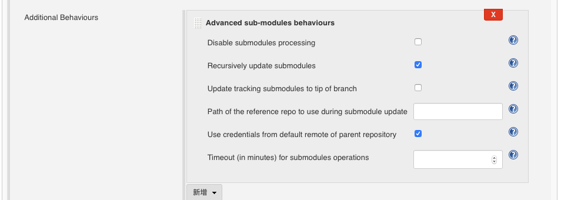

# 前言

iOS持续集成采用Jenkins已经是一个非常成熟的方案了，以前公司用过，自己还没尝试搭建过，这次尝试了一下，踩了很多坑，网上的很多文章都是早些年的，都9102年了，Jenkins也有了很多变化，Xcode也是10.x版本了。我分享一下我个人觉得要注意的细节。

<!-- more -->
# 环境介绍

- 系统版本：macOS Mojave 10.14.4 (18E226)
- Xcode版本：Version 10.1 (10B61)
- Jenkins版本：Jenkins ver. 2.164.2

我的项目集成了cocoapods和2个Project，其中一个Project用了Git的submodule。


# 开始搭建

Jenkins下载安装，完成后打开Jenkins的界面，下载一些插件，新建一个空的任务。接下来开始配置，配置我是分三步：1、下载源码 2、配置证书和打包选项 3、上传ipa。


## 下载源码


源码我使用的是Git，代码放在gitee，其实放哪都是类似的。设置Repository URL和SSH，如果配置错误的话，界面会一直报错。Submodule的配置，需要勾选上
`Additional Behaviours`

其中第二项的意思是submodule的验证跟主项目一致，我的项目是一致的，可以勾上，若不是的话，需要在想办法，这里没有在深入研究。

cocoapods的话需要在构建中加入shell

```highlight 
 export LC_ALL=en_US.UTF-8
/usr/local/bin/pod install --verbose --no-repo-update 

```
可以先尝试一下构建，如果成功。建议去`工作空间`，找到项目所在的目录,把整个项目复制出来，自己先编译一下，是否能编译过。

注意：

- 源码SSH一定要切换到jenkens账户，否则一直报错，参考[指定Git源代码时提示无权限](https://www.jianshu.com/p/ed0edb93e234)
- 当时我配置URL clone的方式，怎么都会报错，后来换成SSH就OK了。
- `export LC_ALL=en_US.UTF-8`这句话得加，否则会报错

## 配置证书和打包选项

配置证书比较繁琐，首先去`Jenkins
Keychains and Provisioning Profiles Management`上传本机的keychain和Provisioning Profiles，这个网上有教程，可以[参考一下](https://www.jianshu.com/p/70e4335b0bd6),这里介绍的比较详细。Provisioning Profiles拿到的都是UUID的文件名，可以去用xcode打开项目，build settings，搜索profiles，就能找到对应的UUID，上传即可。
添加完后，再到回到`刚建的任务-设置-构建-增加构建步骤`，新增一个xcode，开始配置xcode。

第一项`General build settings` ：`Development Team ID`这一项，如果不知道从哪里查的话，先用自己的xcode打个包，导出ipa的文件目录中有`ExportOptions.plist`中的`team id`。
把`Generate Archive?`设置为`YES`,又会多出很多选项，`Output directory`建议是`${WORKSPACE}/Build`,如果不在workspace的话，会报错。

第二项`Code signing & OS X keychain options`：我一开配置好的，然后选`Read from Xcode Project`，一直都是失败，建议不要勾选这个选项。勾选`Manual signing`和`Unlock Keychain?`把该选的选上，`Keychain password`就是本机的登录密码。

第三项`Advanced Xcode build options`：这个也比较简单，如果项目是workspace，直接在`Xcode Workspace File`填上workspace的路径就行了，注意不需要填后缀。但是建议还是把其他选项都填上，其中`Xcode Project Directory`会影响第四项的配置，不填的话，会找不到info.plist，导致无法更改`CFBundleVersion`。

第四项`Versioning `：这一项是用于每次构建，动态变更build number的，一般在`Technical version`填上`${BUILD_ID}`。


配置完成后，可以构建一下，看看能不能成功。如果失败的话，可以查看一下原因，或者仿照第一步拉源码，把项目拷出来，用xcodebuild尝试打包，确保自己的项目是可以打包的，再查找Jenkins配置的问题。


## 上传ipa

这一部非常简单，我使用的是蒲公英，[使用 Jenkins 实现持续集成 (iOS)](https://www.pgyer.com/doc/view/jenkins_ios),先去Jenkins插件下一个`Upload to pgyer`,再到`刚建的任务-设置-构建-增加构建步骤`，增加一个`Upload to pgyer with api v2`，`pgyer api_key`可以在蒲公英官网找到，`scandir`就是ipa所在的目录，`file wildcard`是指ipa的文件通配符，注意不是文件的全程，如果目录下只有一个ipa，使用`*.ipa`即可。


#  结语

每个人的环境和需求都不一样，如果配置过程中出了问题，一定要多看控制台输出，看看哪里报错，报错的原因是什么，错误信息还是比较详细的，一步一步解决。
