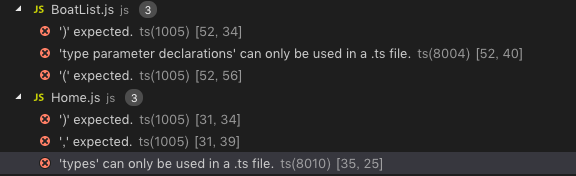

# 前言
最近在学习RN的使用，实在受不了webstorm的性能，IDE换成了VS Code，对于我这种渣渣电脑，至少用起来不卡了，还有很多插件，非常方便，好评！
<!-- more -->
# 问题
在用到带参数的指定类型的方法时，比如`_onPressItem = (id: string) => `，VSCode会报错`[js] 'types' can only be used in a .ts file`。

虽然不影响程序的运行，但是这个正确的写法，报什么错呢？

# 解决
这个问题其实归结于是VSCode使用Flow的bug，在VSCode的issue里，开发者建议我们使用一个叫[Flow Language Support](https://marketplace.visualstudio.com/items?itemName=flowtype.flow-for-vscode)的插件，使用后发现并没有解决，还会报Flow版本不匹配的错误，遂放弃，继续寻找到一个新的插件[vscode-flow-ide
](https://marketplace.visualstudio.com/items?itemName=gcazaciuc.vscode-flow-ide#overview),但是安装完成后，发现错误还在。

在Stack Overflow和各种issue中寻找了很久，一般都是给两条路子：

1 安装插件，例如`Flow Language Support`，`vscode-flow-ide`推荐后者。
2 在VSCode中设置

```highlight
"typescri.validate.enable": false,
"javascript.validate.enable": false,
```
PS：像我这种小白根本找不到VSCode中哪里能设置这个，大家都没写，搜了半天，最后在`Code->Preferences->Settings`中搜索，才找到`settings.json`这个文件，路径是`/Users/你的计算机名/Library/Application Support/Code/User/settings.jsonpt`。


最后尝试后，我是两条都用了，才解决,希望能帮到你们。

# 参考资料
[1] [Flow - JS静态类型检查工具](https://segmentfault.com/a/1190000008088489)

[2][jstwister/vscode-flow-ide](https://github.com/jstwister/vscode-flow-ide)

[3][How to disable TypeScript warnings in VSCode?
](https://stackoverflow.com/questions/42632215/how-to-disable-typescript-warnings-in-vscode/42633555#42633555)